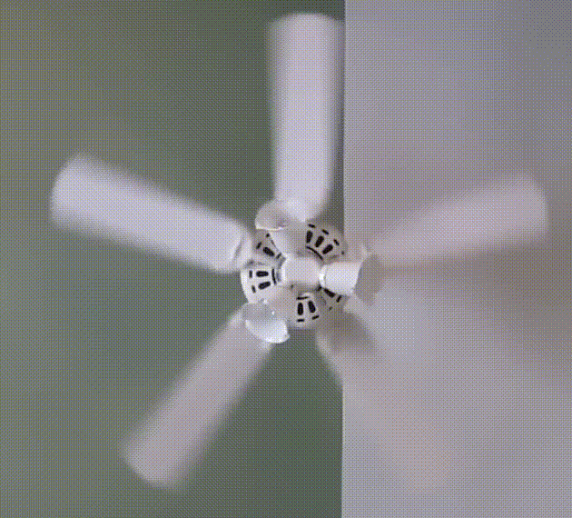
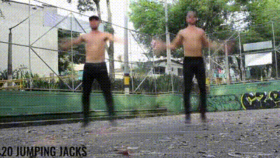

# SloMoLoops
## Turning periodic videos into slow motion videos with topological data analysis and graph theory
### By [Christopher Tralie] and [Matthew Berger]

## Abstract

We consider the problem of taking a video that is comprised of multiple periods of repetitive motion, and reordering the frames of the video into a single period, producing a detailed, single cycle video of motion. This problem is challenging, as such videos often contain noise, drift due to camera motion and from cycle to cycle, and irrelevant background motion/occlusions, and these factors can confound the relevant periodic motion we seek in the video. To address these issues in a simple and efficient manner, we introduce a tracking free Eulerian approach for synthesizing a single cycle of motion. Our approach is geometric: we treat each frame as a point in high-dimensional Euclidean space, and analyze the sliding window embedding formed by this sequence of points, which yields samples along a topological loop regardless of the type of periodic motion.  We combine tools from topological data analysis and spectral geometric analysis to estimate the phase of each window, and we exploit the sliding window structure to robustly reorder frames.  We show quantitative results that highlight the robustness of our technique to camera shake, noise, and occlusions, and qualitative results of single-cycle motion synthesis across a variety of scenarios.

## Dependencies
* Numpy/Scipy/Matplotlib
* [ripser python package] for persistent homology
* [imageio] for efficient video I/O
* [pyTorch] (Optional) For using resnet features instead of an image pyramid for mitigating motion drift

## Running
To see all of the options, run the script as follows

~~~~~ bash
python VideoReordering.py --help
~~~~~

We will now go through a brief example toggling on and off some of the most common features.  First, we'll start with the video <a href = "http://www.ctralie.com/Research/SloMoLoops/JumpingJacks_Occlusions.avi">JumpingJacks_Occlusions.avi</a>, which is a video of two men doing jumping jacks with a drifting occluding object added

<video controls>
  <source src='http://www.ctralie.com/Research/SloMoLoops/jumpingjacksbg.ogg' type="video/ogg">
Your browser does not support the video tag.
</video>

Now, let's do a simple reordering where we shuffle the frames by their circular coordinates, using a weighted Laplacian

~~~~~ bash
python VideoReordering.py --filename JumpingJacks_Occlusions.avi --is-simple-reorder --is-weighted-laplacian --show-plots
~~~~~

We get the following result

The code also outputs the following plot, which gives more information about the TDA and the Laplacian circular coordinates

The above result is choppy, so let's do a median voting instead now

~~~~~ bash
python VideoReordering.py --filename JumpingJacks_Occlusions.avi --is-median-reorder --is-weighted-laplacian
~~~~~

The result is much smoother, and most of the occlusions and unrelated background motions have been removed

[Christopher Tralie]: <http://www.ctralie.com>
[Matthew Berger]: <https://matthewberger.github.io/>
[ripser python package]: <https://github.com/ctralie/ripser>
[pyTorch]: <http://pytorch.org/>
[imageio]: <http://imageio.readthedocs.io/en/latest/installation.html>
